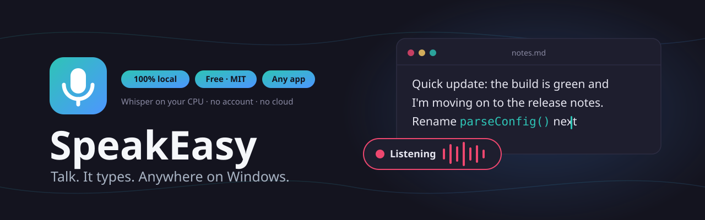
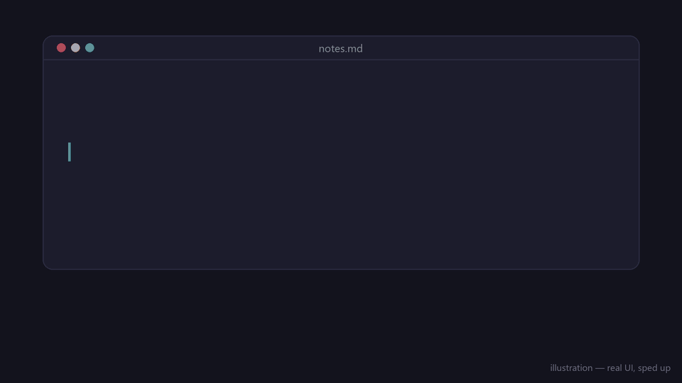
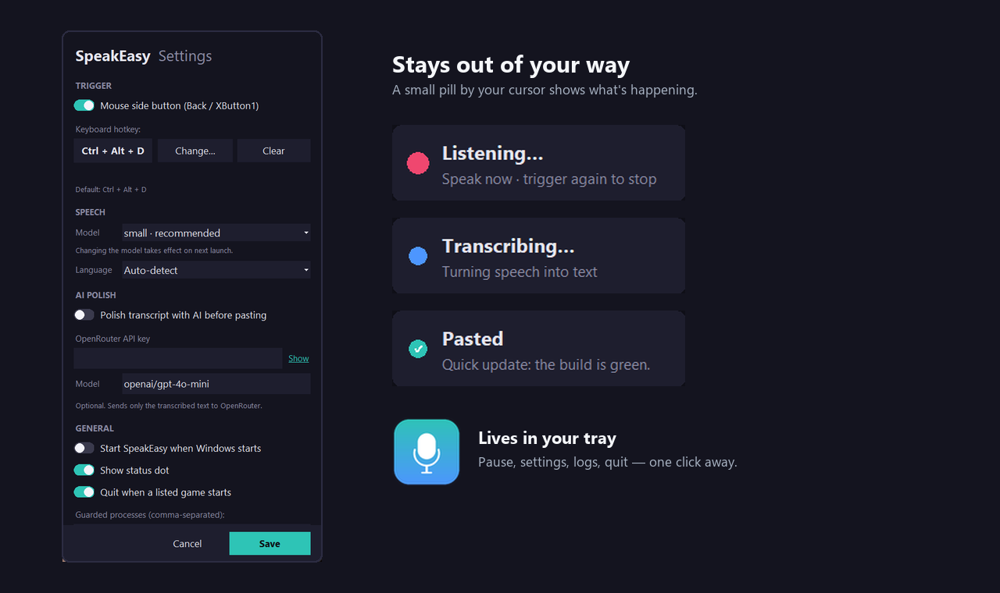
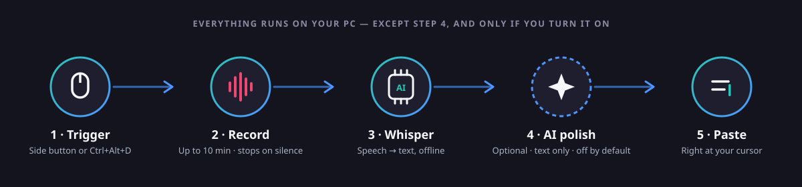
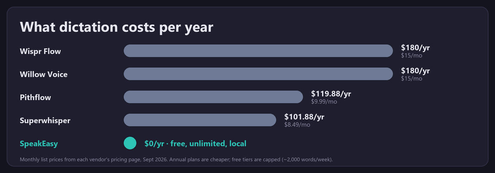

<p align="center">
  
</p>

<p align="center">
  <a href="https://github.com/awesomo913/speakeasy/releases/latest"></a>
  <a href="https://github.com/awesomo913/speakeasy/releases"></a>
  <a href="LICENSE"></a>
  
  <a href="https://github.com/awesomo913/speakeasy/actions/workflows/ci.yml"></a>
  
</p>

<p align="center"><b>Press a button, talk, and your words get typed wherever your cursor is — any app, on Windows, with speech-to-text that never leaves your PC.</b></p>

<p align="center">
  <a href="https://github.com/awesomo913/speakeasy/releases/latest"><b>⬇ Download for Windows</b></a>
</p>

<p align="center">
  
</p>

## Why SpeakEasy

- **Actually local.** Speech-to-text runs on your CPU via [faster-whisper](https://github.com/SYSTRAN/faster-whisper). No account, no subscription, no audio ever leaves your machine.
- **Works everywhere.** Not tied to one app — dictate into your editor, browser, terminal, chat, or an AI prompt.
- **Built for long dictation.** Up to 10 minutes per recording, auto-stops after 10 seconds of silence — no need to babysit it.
- **Coder-friendly.** The optional AI polish pass is told to leave `camelCase`, file paths, and identifiers alone.
- **Free and open source.** MIT licensed. No paywall, no upsell.

## Features

- Trigger by mouse "Back" side button and/or a rebindable keyboard hotkey (default `Ctrl+Alt+D`)
- 100% local transcription via faster-whisper (OpenAI Whisper), selectable model (tiny / base / small / medium / large-v3)
- Auto language detection, or pin a specific language
- Pastes at your cursor via the clipboard, then restores whatever was on your clipboard before
- Optional "AI polish" (off by default): sends only the transcribed **text** — never audio — to OpenRouter with your own API key to clean up filler words and punctuation
- Floating pill overlay that shows recording / transcribing / pasted state near your cursor
- Small draggable status dot near the taskbar: teal = ready, red = recording, blue = transcribing, grey = paused
- Tray menu: pause/resume, settings, open log folder, quit
- Modern dark settings window
- Start-at-login option
- Single instance — launching it twice is a no-op, not a second listener
- "Game guard": auto-quits when a listed game process launches (default: Fortnite), because a low-level mouse hook can interfere with competitive input; the list is editable and the guard can be disabled

## Quick start

1. **[Download the latest release](https://github.com/awesomo913/speakeasy/releases/latest)** and run `SpeakEasy.exe`.
2. First launch downloads the speech model (small, ~480 MB) from Hugging Face — after that it works fully offline.
3. Press the mouse **Back** button (or `Ctrl+Alt+D`), talk, press again — your words appear at your cursor.

## Screenshots

<p align="center">
  
</p>

## How it works

<p align="center">
  
</p>

1. You press the trigger (mouse button or hotkey).
2. SpeakEasy records your mic until you press again or stay silent for 10 seconds.
3. faster-whisper transcribes the audio locally, on your CPU.
4. If AI polish is enabled, the text (not the audio) is sent to OpenRouter for cleanup.
5. The result is pasted at your cursor and your previous clipboard is restored.

## Privacy

- **Stays on your PC, always:** your microphone audio, the recording, and the local transcription. Nothing is uploaded unless you turn on AI polish.
- **Only sent if you enable AI polish:** the transcribed *text* (never audio) goes to OpenRouter using an API key you supply. If that request fails for any reason, SpeakEasy pastes the raw transcript instead — a dictation is never silently lost.
- No telemetry, no analytics, no account required.

<details>
<summary>Where does SpeakEasy store data?</summary>

- Settings: `%APPDATA%\SpeakEasy\settings.json`
- Logs: `%LOCALAPPDATA%\SpeakEasy\logs`

</details>

## Settings reference

| Setting | Default | Notes |
|---|---|---|
| Trigger — mouse button | Enabled | The mouse "Back" side button; can be disabled |
| Trigger — hotkey | `Ctrl+Alt+D` | Rebindable in Settings |
| Whisper model | `small` | tiny / base / small / medium / large-v3 |
| Language | Auto-detect | Or pin a specific language |
| Max recording length | 10 minutes | Auto-stops after 10s of silence |
| AI polish | Off | Requires your own OpenRouter API key |
| Start at login | Off | Adds/removes a Startup shortcut |
| Status dot | Shown | Draggable, near the taskbar |
| Game guard | Enabled (Fortnite) | Editable process list, or disable entirely |

## Choosing a model

Bigger models are more accurate and slower. All run on CPU — no GPU required.

| Model | Approx. download | Speed | Accuracy |
|---|---|---|---|
| tiny | ~75 MB | Fastest | Lowest |
| base | ~145 MB | Fast | Basic |
| small (default) | ~480 MB | Balanced | Good |
| medium | ~1.5 GB | Slower | Better |
| large-v3 | ~3 GB | Slowest | Best |

## Comparison

<p align="center">
  
</p>

| | SpeakEasy | Windows Voice Typing (Win+H) | Paid cloud dictation apps |
|---|---|---|---|
| Cost | Free | Free | Paid / subscription |
| Works offline | Yes | Varies | No |
| Audio leaves your PC | No | Varies | Usually yes |
| Long dictation (10+ min) | Yes | Varies | Varies |
| Works in any app | Yes | Yes | Varies |
| Coder-friendly polish (identifiers, paths preserved) | Yes (optional) | No | Varies |
| Open source | Yes | No | No |

## FAQ

<details>
<summary>Windows says "Windows protected your PC" — is this safe?</summary>

SpeakEasy's release `.exe` isn't code-signed (signing certificates cost money for an independent open-source project), so Windows SmartScreen flags unknown publishers by default. Click **More info → Run anyway**, or verify the download against `SHA256SUMS.txt` on the [release page](https://github.com/awesomo913/speakeasy/releases/latest), or build from source yourself (see below).
</details>

<details>
<summary>My antivirus flagged the .exe — is it malware?</summary>

PyInstaller-built executables are frequently false-positived by antivirus engines because the same packing technique is also used by actual malware to bundle a Python interpreter. This is a known, common issue for PyInstaller apps in general. If you'd rather not trust the prebuilt binary, build from source — it's a few commands (below) and you can read every line first.
</details>

<details>
<summary>I don't have a mouse side button — can I still use SpeakEasy?</summary>

Yes. The keyboard hotkey (`Ctrl+Alt+D` by default, rebindable) works independently of the mouse trigger, and the mouse trigger can be disabled entirely in Settings.
</details>

<details>
<summary>Does SpeakEasy work on Mac or Linux?</summary>

Not yet — it's Windows-only today (it relies on Windows-specific input hooks and the clipboard). Contributions toward macOS/Linux support are welcome; see the roadmap below.
</details>

<details>
<summary>Does it use my GPU?</summary>

Not currently — transcription runs on CPU only. GPU/CUDA acceleration is on the roadmap.
</details>

<details>
<summary>Where are the logs?</summary>

`%LOCALAPPDATA%\SpeakEasy\logs`. The tray menu has an "Open log folder" shortcut.
</details>

<details>
<summary>How do I uninstall?</summary>

1. Quit SpeakEasy from the tray menu.
2. Delete `SpeakEasy.exe`.
3. Delete the `%APPDATA%\SpeakEasy` and `%LOCALAPPDATA%\SpeakEasy` folders.
4. If you enabled "start at login," remove the `SpeakEasy.lnk` shortcut from your Startup folder (`shell:startup`).
</details>

## Build from source

Requires Python 3.11.

```bash
git clone https://github.com/awesomo913/speakeasy.git
cd speakeasy
pip install -r requirements.txt
# or: uv pip install -r requirements.txt
python main.py
```

Build the standalone exe:

```bash
pip install -r requirements-dev.txt
python build.py
# → dist/SpeakEasy.exe
```

Run tests and lint:

```bash
pytest
ruff check .
```

## Roadmap

- [ ] Push-to-talk hold mode
- [ ] GPU/CUDA acceleration
- [ ] Custom vocabulary
- [ ] Voice snippets
- [ ] Local LLM polish via Ollama
- [ ] macOS/Linux ports
- [ ] Signed builds
- [ ] winget/scoop package

## Contributing

Contributions are welcome — see [CONTRIBUTING.md](CONTRIBUTING.md) for dev setup, code style, and good-first-issue ideas.

If SpeakEasy saves you typing, a ⭐ helps others find it.

## License

[MIT](LICENSE) © 2026 awesomo913
